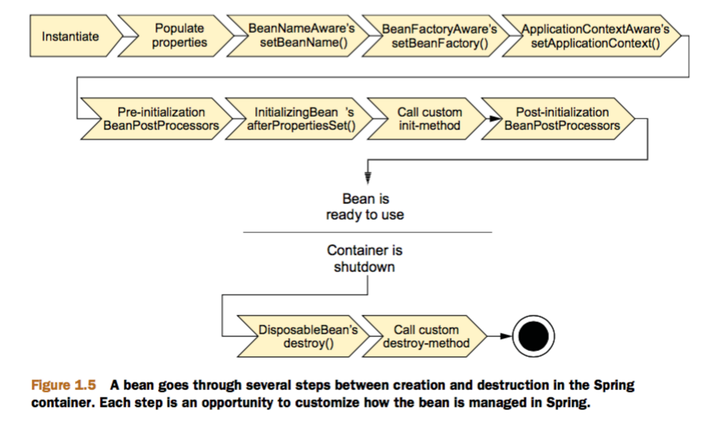
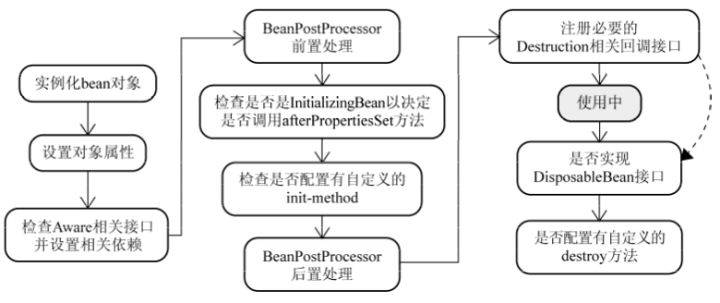
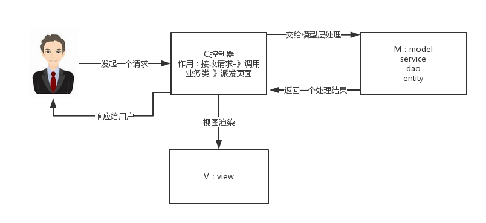
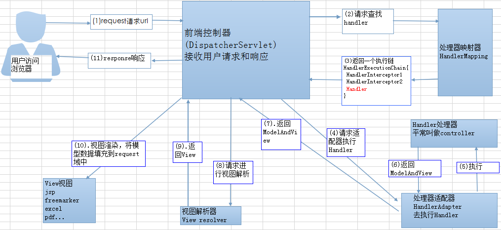

## Spring IoC 和 AOP
### IoC
IoC（Inverse of Control：控制反转）是一种设计思想，就是将**原本在程序中手动创建对象的控制权，交由Spring框架来管理**。 IoC 在其他语言中也有应用，并非 Spirng 特有。 IoC 容器是 Spring 用来实现 IoC 的载体，IoC 容器实际上就是个Map（key，value），Map 中存放的是各种对象。

将对象之间的相互依赖关系交给 IoC 容器来管理，并由 IoC 容器完成对象的注入。这样可以很大程度上简化应用的开发，把应用从复杂的依赖关系中解放出来。 **IoC 容器就像是一个工厂一样，当我们需要创建一个对象的时候，只需要配置好配置文件/注解即可，完全不用考虑对象是如何被创建出来的。** 在实际项目中一个 Service 类可能有几百甚至上千个类作为它的底层，假如我们需要实例化这个 Service，你可能要每次都要搞清这个 Service 所有底层类的构造函数。如果利用 IoC 的话，你只需要配置好，然后在需要的地方引用就行了，这大大增加了项目的可维护性且降低了开发难度。

Spring 时代我们一般通过 XML 文件来配置 Bean，后来开发人员觉得 XML 文件来配置不太好，于是 SpringBoot 注解配置就慢慢开始流行起来。

### Spring IoC 的初始化过程

[Spring IoC 初始化源码分析](https://doocs.github.io/source-code-hunter/#/?id=ioc-%e5%ae%b9%e5%99%a8)

### IoC 和 DI的区别
IoC 控制反转，指将对象的创建权，反转到Spring容器，DI 依赖注入，指Spring创建对象的过程中，将对象依赖属性通过配置进行注入。

### BeanFactory 接口和 ApplicationContext 接口的区别 
1. ApplicationContext 接口继承BeanFactory接口，Spring核心工厂是BeanFactory，BeanFactory采取延迟加载，第一次 getBean() 时才会初始化 Bean，ApplicationContext 是会在加载配置文件时初始化 Bean；
2. ApplicationContext 是对 BeanFactory 扩展，它可以进行国际化处理、事件传递和 bean 自动装配以及各种不同应用层的 Context 实现。

开发中基本都在使用ApplicationContext, web项目使用WebApplicationContext ，很少用到BeanFactory。
```java
BeanFactory beanFactory = new XmlBeanFactory(new ClassPathResource("applicationContext.xml"));
IHelloService helloService = (IHelloService) beanFactory.getBean("helloService");
helloService.sayHello();
```

### AOP
AOP（Aspect-Oriented Programming：面向切面编程）能够将那些与业务无关，却为业务模块所共同调用的逻辑或责任（例如事务处理、日志管理、权限控制等）封装起来，便于减少系统的重复代码，降低模块间的耦合度，并有利于未来的可拓展性和可维护性。


Spring AOP 就是基于动态代理的，如果要代理的对象，实现了某个接口，那么 Spring AOP 会使用 JDK Proxy，去创建代理对象，而对于没有实现接口的对象，就无法使用 JDK Proxy 去进行代理了，这时候Spring AOP会使用Cglib，这时候 Spring AOP 会使用 Cglib 生成一个被代理对象的子类来作为代理，如下图所示：


当然也可以使用 AspectJ，Spring AOP 已经集成了AspectJ，AspectJ 应该算的上是 Java 生态系统中最完整的 AOP 框架了。

使用 AOP 之后我们可以把一些通用功能抽象出来，在需要用到的地方直接使用即可，这样大大简化了代码量。我们需要增加新功能时也方便，这样也提高了系统扩展性。日志功能、事务管理等等场景都用到了 AOP。

### Spring AOP 和 AspectJ AOP 的区别
Spring AOP 属于运行时增强，而 AspectJ 是编译时增强。 Spring AOP 基于代理(Proxying)，而 AspectJ 基于字节码操作(Bytecode Manipulation)。

Spring AOP 已经集成了 AspectJ  ，AspectJ  应该算的上是 Java 生态系统中最完整的 AOP 框架了。AspectJ  相比于 Spring AOP 功能更加强大，但是 Spring AOP 相对来说更简单，如果我们的切面比较少，那么两者性能差异不大。但是，当切面太多的话，最好选择 AspectJ ，它比Spring AOP 快很多。

## Spring 中的 bean
### Spring 中的 bean 的作用域
- singleton：唯一 bean 实例，Spring 中的 bean 默认都是单例的。
- prototype：每次请求都会创建一个新的 bean 实例。
- request：每一次HTTP请求都会产生一个新的bean，该bean仅在当前HTTP request内有效。
- session：每一次HTTP请求都会产生一个新的 bean，该bean仅在当前 HTTP session 内有效。
- application：作用于 ServletContext 的生命周期。
- websocket：作用于 WebSocket 的生命周期。

### Spring 中的单例 bean 的线程安全问题
大部分时候我们并没有在系统中使用多线程，所以很少有人会关注这个问题。单例 bean 存在线程问题，主要是因为当多个线程操作同一个对象的时候，对这个对象的非静态成员变量的写操作会存在线程安全问题。
常见的有两种解决办法：
1. 在Bean对象中尽量避免定义可变的成员变量（不太现实）。
2. 在类中定义一个ThreadLocal成员变量，将需要的可变成员变量保存在 ThreadLocal 中（推荐的一种方式）。

### Spring 中的 bean 生命周期
#### 大致的生命周期可以分为：
1. bean 的定义
- 在配置文件里面用 `<bean></bean>` 来进行定义。

2. bean 的初始化
- 在配置文件中通过指定init-method属性来完成
- 实现 `org.springframwork.beans.factory.InitializingBean` 接口

3. bean 的调用
- 三种方式可以得到bean实例，构造器实例化、静态工厂方法实例化和实例工厂方法实例化，并进行调用。

4. bean 的销毁
- 使用配置文件指定的 destroy-method 属性；
- 实现 `org.springframwork.bean.factory.DisposeableBean` 接口.

#### 详细的生命周期：
1. instantiate bean对象实例化，Bean 容器利用 Java Reflection API 创建一个Bean的实例;
2. populate properties 封装属性，如果涉及到一些属性值 利用 set()方法设置一些属性值;
3. 如果 Bean 实现了 BeanNameAware 接口，调用 setBeanName()方法，传入Bean的名字;
4. 如果 Bean 实现 BeanFactoryAware、ApplicationContextAware，执行设置工厂 setBeanFactory 或者上下文对象 setApplicationContext，如果实现了其他 *.Aware接口，就调用相应的方法;
5. 如果有和加载这个 Bean 的 Spring 容器相关的 BeanPostProcessor 对象，执行postProcessBeforeInitialization() 方法，BeanPostProcessor接口提供钩子函数，用来动态扩展修改Bean。(程序自动调用后处理Bean)；
6. 如果Bean实现了InitializingBean接口，执行afterPropertiesSet()方法;
7.  如果 Bean 在配置文件中的定义包含  init-method 属性 `<bean init-method="init"/>`，执行指定的方法;
8.  如果有和加载这个 Bean的 Spring 容器相关的 BeanPostProcessor 对象，执行postProcessAfterInitialization() 方法;
9. 执行业务处理
10. 当要销毁 Bean 的时候，如果 Bean 实现了 DisposableBean 接口，执行 destroy() 方法;
11. 当要销毁 Bean 的时候，如果 Bean 在配置文件中的定义包含 destroy-method 属性 `<bean destroy-method="customerDestroy"/>`，执行指定的方法。





### Spring 配置 bean 实例化有哪些方式
1. 类构造器实例化（默认无参数）
```xml
<bean id="userService" class="com.example.spring.UserService"></bean>
```

2. 静态工厂方法实例化（简单工厂模式）
```xml
<bean id="userService" class="com.example.spring.StaticBeanFactory" factory-method="getUserService"></bean>
```

3. 实例工厂方法实例化（工厂方法模式）
```xml
<bean id="beanFactory" class="com.example.spring.UserBeanFactory"></bean>
<bean id="userService" factory-bean="beanFactory" factory-method="getUserService"></bean>
```

### Bean 的依赖注入方式
1. 基于构造器的依赖注入
```java
public class SimpleMovieLister {
    // the SimpleMovieLister has a dependency on a MovieFinder
    private MovieFinder movieFinder;
    // a constructor so that the Spring container can inject a MovieFinder
    public SimpleMovieLister(MovieFinder movieFinder) {
        this.movieFinder = movieFinder;
    }
    // business logic that actually uses the injected MovieFinder is omitted...
}
```

```xml
<beans>
    <bean id="beanOne" class="x.y.ThingOne">
        <constructor-arg ref="beanTwo"/>
        <constructor-arg ref="beanThree"/>
    </bean>
    <bean id="beanTwo" class="x.y.ThingTwo"/>
    <bean id="beanThree" class="x.y.ThingThree"/>
</beans>
<!--Constructor argument type matching-->
<bean id="exampleBean" class="examples.ExampleBean">
    <constructor-arg type="int" value="7500000"/>
    <constructor-arg type="java.lang.String" value="42"/>
</bean>
<!--Constructor argument index-->
<bean id="exampleBean" class="examples.ExampleBean">
    <constructor-arg index="0" value="7500000"/>
    <constructor-arg index="1" value="42"/>
</bean>
<!--Constructor argument name-->
<bean id="exampleBean" class="examples.ExampleBean">
    <constructor-arg name="years" value="7500000"/>
    <constructor-arg name="ultimateAnswer" value="42"/>
</bean>
```

2. 基于 Setter 的依赖注入
```java
public class SimpleMovieLister {
    // the SimpleMovieLister has a dependency on the MovieFinder
    private MovieFinder movieFinder;
    // a setter method so that the Spring container can inject a MovieFinder
    public void setMovieFinder(MovieFinder movieFinder) {
        this.movieFinder = movieFinder;
    }
    // business logic that actually uses the injected MovieFinder is omitted...
}
```

```xml
<bean id="exampleBean" class="examples.ExampleBean">
    <!-- setter injection using the nested ref element -->
    <property name="beanOne">
        <ref bean="anotherExampleBean"/>
    </property>
    <!-- setter injection using the neater ref attribute -->
    <property name="beanTwo" ref="yetAnotherBean"/>
    <property name="integerProperty" value="1"/>
</bean>
<bean id="anotherExampleBean" class="examples.AnotherBean"/>
<bean id="yetAnotherBean" class="examples.YetAnotherBean"/>
```


## Spring 注解
### 将一个类声明为Spring的 bean 的注解
我们一般使用 @Autowired 注解自动装配 bean，要想把类标识成可用于 @Autowired 注解自动装配的 bean 的类，采用以下注解可实现：
- @Component：通用的注解，可标注任意类为 Spring 组件。如果一个Bean不知道属于拿个层，可以使用 @Component 注解标注。
- @Repository：对应持久层即 Dao 层，主要用于数据库相关操作。
- @Service：对应服务层，主要涉及一些复杂的逻辑，需要用到 Dao层。
- @Controller：对应 Spring MVC 控制层，主要用户接受用户请求并调用 Service 层返回数据给前端页面。

### @Component 和 @Bean 的区别
1. 作用对象不同: @Component 注解作用于类，而 @Bean 注解作用于方法。
2. @Component通常是通过类路径扫描来自动侦测以及自动装配到 Spring 容器中（我们可以使用 @ComponentScan 注解定义要扫描的路径从中找出标识了需要装配的类自动装配到 Spring 的 bean 容器中）。@Bean 注解通常是我们在标有该注解的方法中定义产生这个 bean，@Bean 告诉了 Spring 这是某个类的示例，当我需要用它的时候还给我。
3. @Bean 注解比 Component 注解的自定义性更强，而且很多地方我们只能通过 @Bean 注解来注册bean。比如当我们引用第三方库中的类需要装配到 Spring容器时，则只能通过 @Bean 来实现。

@Bean 注解的使用示例：
```java
@Configuration
public class AppConfig {
    @Bean
    public TransferService transferService() {
        return new TransferServiceImpl();
    }
}
```

上面的代码相当于下面的 xml 配置：
```xml
<beans>
    <bean id="transferService" class="com.acme.TransferServiceImpl"/>
</beans>
```

这种情况无法通过 @Component 实现：
```java
@Bean
public OneService getService(status) {
    case (status)  {
        when 1:
                return new serviceImpl1();
        when 2:
                return new serviceImpl2();
        when 3:
                return new serviceImpl3();
    }
}
```

## Spring MVC 的概念和工作原理
MVC 是一种设计模式,Spring MVC 是一款很优秀的 MVC 框架。Spring MVC 可以帮助我们进行更简洁的Web层的开发，并且它天生与 Spring 框架集成。Spring MVC 下我们一般把后端项目分为 Service层（处理业务）、Dao层（数据库操作）、Entity层（实体类）、Controller层(控制层，返回数据给前台页面)。


工作原理图:


Spring MVC 工作流程：
1. 客户端（浏览器）发送请求，直接请求到 DispatcherServlet。
2. DispatcherServlet 根据请求信息调用 HandlerMapping，解析请求对应的 Handler。
3. 解析到对应的 Handler（也就是我们平常说的 Controller 控制器）后，开始由 HandlerAdapter 适配器处理。
4. HandlerAdapter 会根据 Handler来调用真正的处理器开处理请求，并处理相应的业务逻辑。
5. 处理器处理完业务后，会返回一个 ModelAndView 对象，Model 是返回的数据对象，View 是个逻辑上的 View。
6. ViewResolver 会根据逻辑 View 查找实际的 View。
7. DispaterServlet 把返回的 Model 传给 View（视图渲染）。
8. 把 View 返回给请求者（浏览器）


## Spring 事务管理
### Spring 事务管理方式
1. 编程式事务，在代码中硬编码（不推荐使用）；
2. 声明式事务，在配置文件中配置或基于注解声明（推荐使用）。

### Spring 事务中的隔离级别
TransactionDefinition 接口中定义了五个表示隔离级别的常量：
- TransactionDefinition.ISOLATION_DEFAULT：使用后端数据库默认的隔离级别，Mysql 默认采用的 REPEATABLE_READ隔离级别 Oracle 默认采用的 READ_COMMITTED隔离级别；
- TransactionDefinition.ISOLATION_READ_UNCOMMITTED: 最低的隔离级别，允许读取尚未提交的数据变更，可能会导致脏读、幻读或不可重复读；
- TransactionDefinition.ISOLATION_READ_COMMITTED：允许读取并发事务已经提交的数据，可以阻止脏读，但是幻读或不可重复读仍有可能发生；
- TransactionDefinition.ISOLATION_REPEATABLE_READ:  对同一字段的多次读取结果都是一致的，除非数据是被本身事务自己所修改，可以阻止脏读和不可重复读，但幻读仍有可能发生；
- TransactionDefinition.ISOLATION_SERIALIZABLE：最高的隔离级别，完全服从ACID的隔离级别。所有的事务依次逐个执行，这样事务之间就完全不可能产生干扰，也就是说，该级别可以防止脏读、不可重复读以及幻读。但是这将严重影响程序的性能。通常情况下也不会用到该级别。

### Spring 事务中的几种事务传播行为
支持当前事务的情况：
- TransactionDefinition.PROPAGATION_REQUIRED： 如果当前存在事务，则加入该事务；如果当前没有事务，则创建一个新的事务。
- TransactionDefinition.PROPAGATION_SUPPORTS： 如果当前存在事务，则加入该事务；如果当前没有事务，则以非事务的方式继续运行。
- TransactionDefinition.PROPAGATION_MANDATORY： 如果当前存在事务，则加入该事务；如果当前没有事务，则抛出异常。（mandatory：强制性）

不支持当前事务的情况：
- TransactionDefinition.PROPAGATION_REQUIRES_NEW： 创建一个新的事务，如果当前存在事务，则把当前事务挂起。
- TransactionDefinition.PROPAGATION_NOT_SUPPORTED： 以非事务方式运行，如果当前存在事务，则把当前事务挂起。
- TransactionDefinition.PROPAGATION_NEVER： 以非事务方式运行，如果当前存在事务，则抛出异常。

其他情况：
- TransactionDefinition.PROPAGATION_NESTED： 如果当前存在事务，则创建一个事务作为当前事务的嵌套事务来运行；如果当前没有事务，则该取值等价于TransactionDefinition.PROPAGATION_REQUIRED。


## Spring 中的设计模式


## Spring 中的核心类解析
