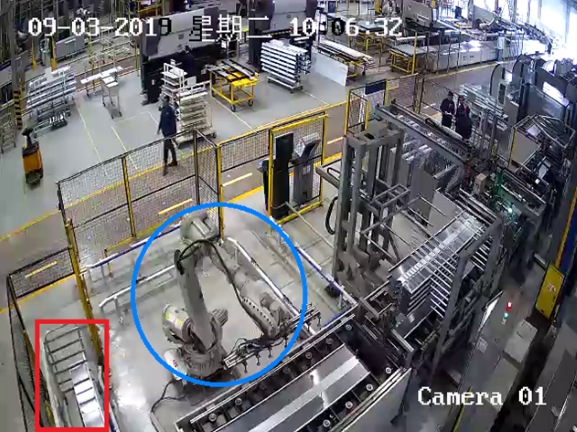
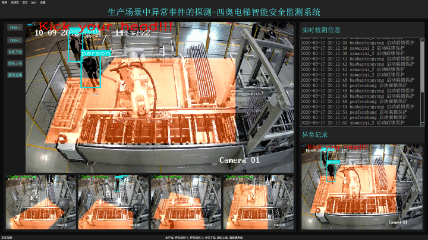
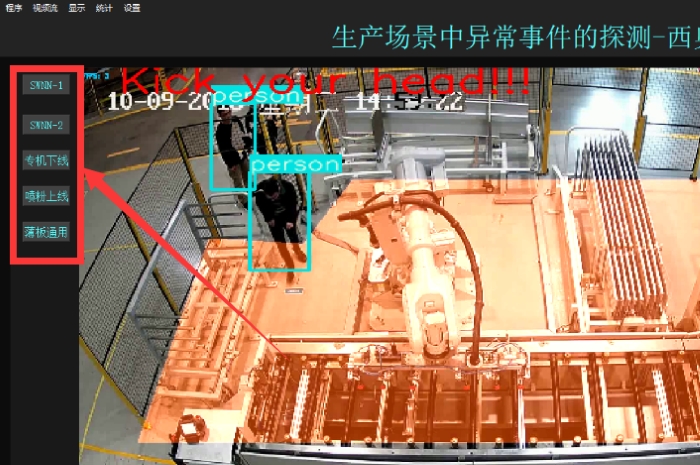
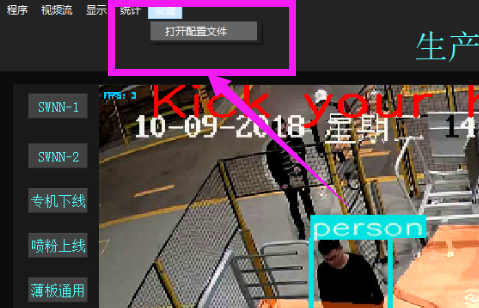
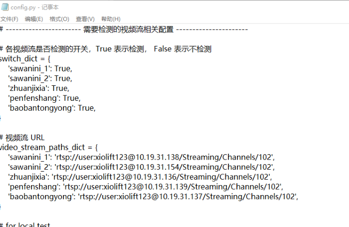
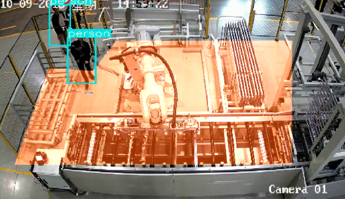
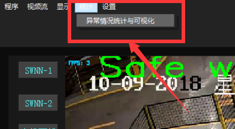
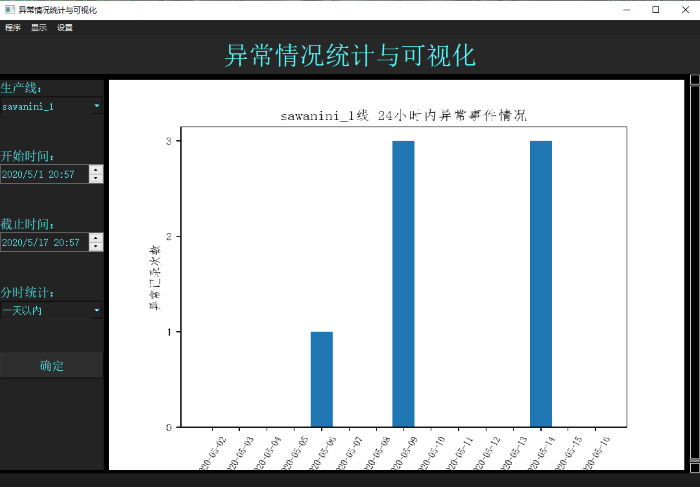
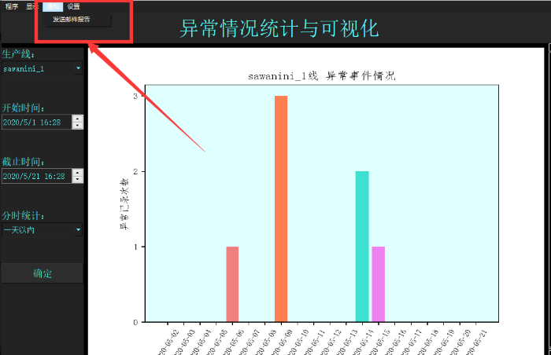
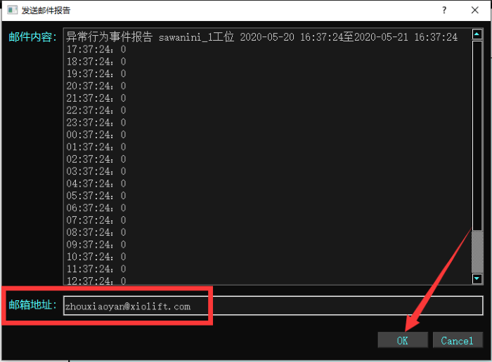

## 项目背景简介
为打造智能工厂和接轨工业4.0的生产制造的趋势，在杭州西奥电梯公司的扶梯生产制造车间内有着一批全自动的机器人（多自由度可编程机械臂）（图中蓝色圈出部分），机器人在各自特定的区域按照工程师提前编写测试的程序，智能检测流水线进程，各司其职地完成任务。

西奥电梯公司所采用的机器人大多都是6个旋转自由度且上百公斤级的大型工业级机械臂，虽然机器人工作区周围都设有安全警戒线和栅栏，栅栏通道口有红外光栅报警装置，但是由于工程师需要定期进入机器人工作区进行调试和检查工作，同时岗位工人需要及时将生产好的产品推车（图中红色框框出部分）拖出工作区，这就导致在人机配合过程中存在人身安全隐患！

栅栏通道口的红外光栅报警装置对有通过通道口的物体做检测和报警，但是装载推车会频繁地进出工作区，红外检测装置由于无法分辨是人还是推车的进出，所以也会随之报警，但这种误判的程度会大大降低生产效率和工人对光栅报警的适应性忽略。另一种特殊情况是当工程师暂停机器人工作，进入机器人工作区进行调试和检查工作时，工人可能因为物体遮挡等原因未能看到工程师在区域内，而按下外部控制台机器人复位按钮，接下来机器人将继续运转工作，这将正在区域内工作的工程师置于极其危险的处境。为避免类似状况发生和最大限度提升智能工厂中人员与机器交互的安全系数，团队致力解决问题，提供了一个实时、精准、高效的解决方案，并开发出一套完备的车间安全行为的无人监控、报警与紧急制动系统，现已部署上线。

## 技术方案描述
通过架设在正对机器人工作区的监控摄像头实时采集回的视频录像，对车间内各个机器人工作区的机器人运作、生产情况和人员动向情况实时自主检测与监管。具体方案总结为以下三点：
1. 在视频监控录像画面中利用图像掩模设定机器人工作区（警戒区）；
2. 利用精良的深度学习目标检测模型实时检测视频录像中的所有人员、位置和动向；
3. OPC技术为系统提供实时读取机器人节点运作状态以及紧急制动操作的支持。

## 视频实时读取与可视化
视频实时检测界面：

双击系统图标，启动系统，自动读取西奥电梯生产车间内多个工位摄像头的实时视频数据，进行人员异常行为事件的探测，将实时的检测结果和信息绘制并滚动显示在系统界面上。界面的左边部分显示各个工位的检测实况，右边部分分别滚动显示实时检测信息和最近一次出现人员异常行为的图像记录。

点击系统界面右上角的按钮，用来切换大屏显示的工位。

点击系统界面上菜单栏“设置”-“打开配置文件”，即可通过记事本打开系统属性的设置文件，在文件中通过修改视频流相关属性，即可以切换系统检测的工位摄像头。

## 异常事件的实时探测
系统通过深度学习目标检测技术，自动地对生产车间内人员的异常行为事件进行实时检测，并在将人员异常情况绘制显示在系统界面视频栏中。

## 生产过程的实时控制
当系统探测到在某个工位上发生人员异常行为事件时，将立即做出响应，对人员启动连锁保护程序，紧急停止机器运转，发出报警信号。等待系统检测到人员离开危险区域后，解除连锁保护程序，允许机器恢复正常运转。

## 异常事件的统计与可视化

点击系统菜单栏中“统计”-“异常情况统计与可视化”，即可打开系统对生产车间内历史异常记录的统计与可视化界面。在界面的左边部分分别选择和输入生产线、统计开始时间、统计截止时间和分时段统计选项，点击确定按钮，界面即显示出该生产线工位，各时段异常时间出现的次数图形。

## 异常事件的报警与发送
点击菜单栏“通知”-“发送邮件报告”，即可打开发送异常事件报告的界面。

发送邮件报告界面的上方部分的文本框是系统生产的异常事件报告的内容，也就是将要作为邮件发送的内容，下方部分的框中填写要发送的邮箱地址，这里默认是西奥电梯公司工程管理部门相关人员的邮箱地址。点击“OK”按钮即可自动发送该邮件。
